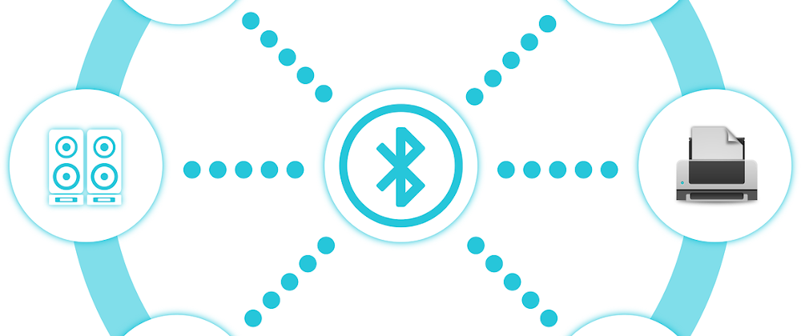
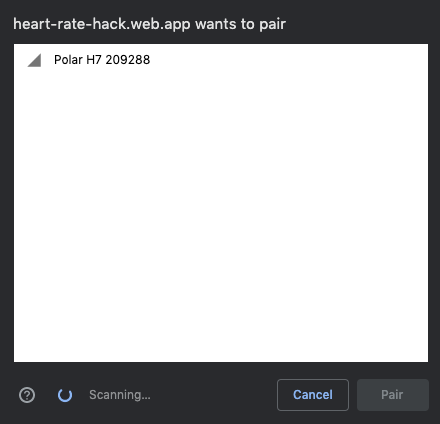

# BLE and GATT



If you'd asked me ten years ago what I knew about Bluetooth, I would have probably told you it's what we use to send each other photos that we'd taken on our new camera phones. If you'd asked me five years ago, I probably would have mentioned something about all the new fancy cars using Bluetooth for wireless phone calls and playing music. Just over a year ago I started researching Web Bluetooth, and if you ask me now, I could probably talk about it for hours (and I do). The idea of working with Bluetooth devices directly from the browser is really exciting. There is a lot of potential and many use cases for this web platform feature. It is also a really fun technology to play with, since there are so many Bluetooth devices out there.

The Web Bluetooth API is all about connecting to Bluetooth Low Energy (BLE) devices directly from the browser. It has a few limitations, however, this should not stop you from trying it out. Here are some good resources I used to get started:

- [Interact with Bluetooth devices on the Web](https://developers.google.com/web/updates/2015/07/interact-with-ble-devices-on-the-web)
- [Is Now a Good Time to Start using Web Bluetooth?](https://medium.com/@urish/is-now-a-good-time-to-start-using-web-bluetooth-hint-yes-yes-it-is-99e998d7b9f6)
- [The Mission Bluetooth Module for Angular](https://dev.to/angular/the-web-bluetooth-module-for-angular-314b)
- [Web Bluetooth API Specification](https://webbluetoothcg.github.io/web-bluetooth/)

First, we need to make sure we understand how the hardware side of things is going to work. In this article, I'd like to tell you what you need to know about BLE and GATT, so that you can hack away at your own Bluetooth devices using JavaScript.

## GATT

The Bluetooth Generic Attributes (GATT) Profile is the way that Bluetooth devices communicate with each other. It defines a hierarchical data structure for communication between two BLE devices. It is based on the Attribute Protocol (ATT), which is a low level mechanism for transferring units of data. This profile facilitates the communication between a central device, such as your phone or computer, and a peripheral device, such as a heart rate monitor or Bluetooth headphones.

Let's take a look at a small piece of code adapted from the [Web Bluetooth Community Group GitHub](https://github.com/WebBluetoothCG/demos) for connecting to and reading data from a Bluetooth heart rate monitor.

```js
let characteristic;

async function connect() {
    const device = await navigator.bluetooth.requestDevice({filters:[{services:[ 'heart_rate' ]}]});
    const server = await device.gatt.connect();
    const service = await server.getPrimaryService('heart_rate');
    characteristic = await service.getCharacteristic('heart_rate_measurement');
}

async function startNotification() {
    return await characteristic.startNotifications();
}

async function stopNotification() {
    return await characteristic.stopNotifications();
}
```

## Profile, Server and Client

```js
const device = await navigator.bluetooth.requestDevice({filters:[{services:[ 'heart_rate' ]}]});
```

In the code above we are initiating a scan for a Bluetooth devices. We are using a filter so that we will only show devices that have a `heart_rate` service (we will talk about the service a little later). This will present the user with something that looks like this:



The filter is there for two reasons:

1. So that we do not confuse the user if there is a large number of devices in the list.
2. Making the user feel a little bit more secure by limiting what devices the programmer can scan for.

It is also important to note that this scan can only be initiated by a user interaction.

Once the user has selected a device and clicked pair we can connect to the device:

```js
const server = await device.gatt.connect();
```

The peripheral device (heart rate monitor in this case), also known as the **GATT Server**, holds the profile. The central device (our computer or phone), also known as the **GATT Client**, is the device that initiates the connection, sends instructions to the server and receives data back from it. How the data travels between the two devices is defined by Services and Characteristics. A profile consists of a number of services.

## Services

```js
const service = await server.getPrimaryService('heart_rate');
```

Services are the behaviours of a device. For example, our heart rate monitor has a heart rate service. The service is identified by a universally unique identifier (UUID). A service consists of connections or references to other services as well as one or more characteristics.

## Characteristic

```js
characteristic = await service.getCharacteristic('heart_rate_measurement');
```

A characteristic is a specific function of the device. In our example we have the measurement of the heart rate as the characteristic we are going to be interacting with. A characteristic also has a UUID to identify it, a value usually stored in an unsigned integer array, as well as a number of properties and permissions. The properties and permissions define the following:

- **Read**: the value of the characteristic can be read by the central device
- **Write**: the value can be written to
- **Notify**: the value will be sent from the peripheral device to the central device continuously at a set interval

```js
async function startNotification() {
    return await characteristic.startNotifications();
}

async function stopNotification() {
    return await characteristic.stopNotifications();
}
```

The heart rate measurement characteristic in the code above is using the notify property to read the heart rate. We could create an event handler to listen for this notification and show the value on our web page.

This characteristic can only be read, because it does not make sense for you to be able to tell the heart rate monitor what your heart rate is. This means that there is no permission to write to this characteristic.

## Where do I find the UUID

A UUID falls into one of two categories:

1. A name or 16-bit numeric ID, like `heart-rate`, used for common peripheral devices. These are services and characteristics that have been adopted by the [Bluetooth Special Interest Group](https://www.bluetooth.com/).
2. A 128-bit numeric ID, these are used for custom services and characteristics that have been created for devices that are new or differ from the standards. (For example, If you were creating your own bluetooth device using a library like [bleno](https://github.com/noble/bleno), you would create your own 128-bit UUIDs).

For the first, you can find a list of all of them on the Bluetooth SIG website. For the second, you would need to either try and find the definitions in an API or SDK of the device you are using. If that is not possible, you could use something like the nRF Connect app and find your device. The app is available for [desktop](https://www.nordicsemi.com/?sc_itemid=%7BB935528E-8BFA-42D9-8BB5-83E2A5E1FF5C%7D), [Android](https://play.google.com/store/apps/details?id=no.nordicsemi.android.mcp&hl=en_ZA) and [iOS](https://apps.apple.com/za/app/nrf-connect/id1054362403).

## Conclusion

These are some of the basics of BLE and how communication works for Bluetooth devices. If you want to know more about it, you can take a look at the articles on the [Bluetooth SIG](https://www.bluetooth.com/) website, as well as the book [Getting Started with Bluetooth Low Energy](https://www.oreilly.com/library/view/getting-started-with/9781491900550/).

If you'd like to get started with Web Bluetooth, besides the resources I listed above, you can also check out some of my talks:

- [A Web of Things](https://www.youtube.com/watch?v=GP0xo__mWdo)
- [The Physical Web and Beyond](https://www.youtube.com/watch?v=VofwRvURf6s)
 
The Web Bluetooth API is currently not on the standardisation path, and because of this it is not very well [supported](https://caniuse.com/#feat=web-bluetooth). It also has a number of security considerations you should keep in mind, if you are planning on trying it. There are a number of good articles that talk about the security of the API, [this one](https://medium.com/@jyasskin/the-web-bluetooth-security-model-666b4e7eed2) is a good place to start. Even though there are concerns and limitations, it is still a technology that provides us with a great opportunity. I look forward to seeing how this API grows and sharing my knowledge with all of you.